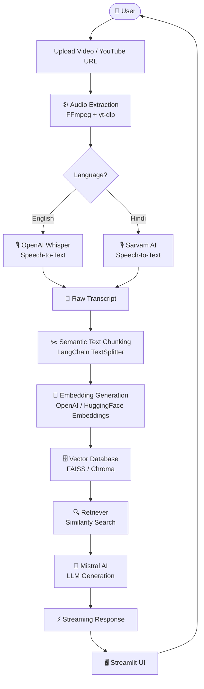

<div align="center">

# 🎬 Video RAG Assistant

### Chat with Any Video — YouTube or Local — in English & Hindi

[](https://python.org)
[](https://langchain.com)
[](https://streamlit.io)
[](https://mistral.ai)
[](LICENSE)
[](CONTRIBUTING.md)

<br/>

> **Video RAG Assistant** transforms any video into an intelligent, searchable knowledge base.  
> Upload a YouTube link or a local file — and start asking questions in natural language.

<br/>


*← Replace with your screen recording*

</div>

---

## 📋 Table of Contents

- [✨ Features](#-features)
- [🏗️ Architecture](#️-architecture)
- [🛠️ Tech Stack](#️-tech-stack)
- [📁 Folder Structure](#-folder-structure)
- [🚀 Installation](#-installation)
- [🔑 Environment Variables](#-environment-variables)
- [⚙️ How It Works](#️-how-it-works)
- [💬 Example Questions](#-example-questions)
- [🗺️ Future Improvements](#️-future-improvements)
- [🤝 Contributing](#-contributing)
- [📄 License](#-license)
- [🙏 Acknowledgements](#-acknowledgements)

---

## ✨ Features

| Feature | Description |
|---|---|
| 🎥 **Multi-Source Upload** | Accepts YouTube URLs or local video files (`.mp4`, `.mkv`, `.mov`, etc.) |
| 🔊 **Automatic Audio Extraction** | Extracts audio tracks using FFmpeg, no manual preprocessing needed |
| 🇬🇧 **English Transcription** | High-accuracy transcription via OpenAI Whisper |
| 🇮🇳 **Hindi Transcription** | Native Hindi speech recognition via Sarvam AI Speech-to-Text |
| ✂️ **Semantic Chunking** | Intelligently splits transcripts into context-preserving chunks |
| 🧠 **Embedding Generation** | Converts text chunks into dense vector representations |
| 🗄️ **Vector Indexing** | Stores and queries embeddings with FAISS for lightning-fast retrieval |
| 🔍 **RAG Pipeline** | Retrieves the most relevant context before every LLM call |
| ⚡ **Streaming Responses** | Token-by-token output from Mistral AI for a smooth chat experience |
| 🖥️ **Clean Streamlit UI** | Simple, intuitive interface — no API calls or CLI required |

---

## 🏗️ Architecture



<details>
<summary>📸 Screenshots</summary>
<br/>

**Upload Screen**


**Transcription Progress**


**Chat Interface**


*← Replace with actual screenshots*

</details>

---

## 🛠️ Tech Stack

| Layer | Technology | Purpose |
|---|---|---|
| **Frontend** | [Streamlit](https://streamlit.io) | Interactive web UI |
| **Orchestration** | [LangChain](https://langchain.com) | RAG pipeline & chain management |
| **LLM** | [Mistral AI](https://mistral.ai) | Language generation & reasoning |
| **English ASR** | [OpenAI Whisper](https://openai.com/research/whisper) | English speech-to-text |
| **Hindi ASR** | [Sarvam AI](https://sarvam.ai) | Hindi speech-to-text |
| **Embeddings** | OpenAI / HuggingFace | Dense vector representations |
| **Vector Store** | [FAISS](https://faiss.ai) / [Chroma](https://trychroma.com) | Similarity search & storage |
| **Audio Extraction** | [FFmpeg](https://ffmpeg.org) | Video → audio conversion |
| **Video Download** | [yt-dlp](https://github.com/yt-dlp/yt-dlp) | YouTube video fetching |
| **Language** | Python 3.10+ | Core application runtime |

---

## 📁 Folder Structure

```
video-rag-assistant/
│
├── 📁 app/
│   ├── 📄 main.py                  # Streamlit entry point
│   ├── 📁 components/
│   │   ├── 📄 upload.py            # Upload & source selection UI
│   │   ├── 📄 chat.py              # Chat interface component
│   │   └── 📄 progress.py         # Processing status indicators
│   └── 📁 styles/
│       └── 📄 custom.css          # Custom Streamlit styling
│
├── 📁 core/
│   ├── 📄 audio_extractor.py      # FFmpeg + yt-dlp audio pipeline
│   ├── 📄 transcriber.py          # Whisper & Sarvam AI integration
│   ├── 📄 chunker.py              # Semantic text chunking logic
│   ├── 📄 embeddings.py           # Embedding model wrappers
│   ├── 📄 vector_store.py         # FAISS / Chroma store management
│   └── 📄 rag_chain.py            # LangChain RAG chain + Mistral AI
│
├── 📁 utils/
│   ├── 📄 validators.py           # URL & file type validation
│   ├── 📄 logger.py               # Structured logging
│   └── 📄 helpers.py              # Shared utility functions
│
├── 📁 data/
│   ├── 📁 uploads/                # Temporary uploaded video files
│   ├── 📁 audio/                  # Extracted audio files
│   ├── 📁 transcripts/            # Generated transcript text files
│   └── 📁 vector_store/           # Persisted FAISS indexes
│
├── 📁 assets/
│   ├── 📄 demo.gif
│   └── 📁 screenshots/
│
├── 📄 .env.example                # Environment variable template
├── 📄 requirements.txt            # Python dependencies
├── 📄 .gitignore
├── 📄 CONTRIBUTING.md
└── 📄 README.md
```

---

## 🚀 Installation

### Prerequisites

- Python 3.10+
- [FFmpeg](https://ffmpeg.org/download.html) installed and on your `PATH`
- API keys for OpenAI, Mistral AI, and Sarvam AI

### Step-by-Step Setup

**1. Clone the repository**

```bash
git clone https://github.com/your-username/video-rag-assistant.git
cd video-rag-assistant
```

**2. Create and activate a virtual environment**

```bash
# macOS / Linux
python -m venv venv
source venv/bin/activate

# Windows
python -m venv venv
venv\Scripts\activate
```

**3. Install dependencies**

```bash
pip install -r requirements.txt
```

**4. Verify FFmpeg is available**

```bash
ffmpeg -version
```

> If not installed: `brew install ffmpeg` (macOS) · `sudo apt install ffmpeg` (Ubuntu) · [Windows installer](https://ffmpeg.org/download.html)

**5. Configure environment variables**

```bash
cp .env.example .env
# Open .env and fill in your API keys
```

**6. Run the application**

```bash
streamlit run app/main.py
```

Open [http://localhost:8501](http://localhost:8501) in your browser.

---

## 🔑 Environment Variables

Copy `.env.example` to `.env` and set the following:

| Variable | Required | Description |
|---|---|---|
| `OPENAI_API_KEY` | ✅ Yes | OpenAI API key for Whisper transcription & embeddings |
| `MISTRAL_API_KEY` | ✅ Yes | Mistral AI key for LLM response generation |
| `SARVAM_API_KEY` | ✅ Yes | Sarvam AI key for Hindi speech-to-text |
| `LANGCHAIN_API_KEY` | ⬜ Optional | LangSmith key for tracing & observability |
| `LANGCHAIN_TRACING_V2` | ⬜ Optional | Set to `true` to enable LangSmith tracing |
| `VECTOR_STORE` | ⬜ Optional | `faiss` (default) or `chroma` |
| `EMBEDDING_MODEL` | ⬜ Optional | Embedding model name (default: `text-embedding-3-small`) |

<details>
<summary>📄 .env.example</summary>

```env
# Required
OPENAI_API_KEY=sk-...
MISTRAL_API_KEY=...
SARVAM_API_KEY=...

# Optional — LangSmith Observability
LANGCHAIN_API_KEY=ls__...
LANGCHAIN_TRACING_V2=true
LANGCHAIN_PROJECT=video-rag-assistant

# Optional — Configuration
VECTOR_STORE=faiss
EMBEDDING_MODEL=text-embedding-3-small
CHUNK_SIZE=500
CHUNK_OVERLAP=50
```

</details>

---

## ⚙️ How It Works

<details>
<summary><strong>1. 🎥 Video Upload</strong></summary>

The user provides either a YouTube URL or uploads a local video file. URLs are validated and routed to `yt-dlp` for download; local files are saved directly to the `data/uploads/` directory.

</details>

<details>
<summary><strong>2. 🔊 Audio Extraction</strong></summary>

FFmpeg strips the audio track from the video and exports it as a `.wav` file. This step normalizes all input formats into a consistent audio stream for downstream processing.

</details>

<details>
<summary><strong>3. 🎙️ Speech Recognition</strong></summary>

Based on the user's selected language:
- **English** → OpenAI Whisper (`whisper-1`) produces a time-stamped transcript.
- **Hindi** → Sarvam AI Speech-to-Text API handles native Devanagari and Hinglish speech.

Both outputs are normalized into a single plain-text transcript file.

</details>

<details>
<summary><strong>4. ✂️ Semantic Text Chunking</strong></summary>

LangChain's `RecursiveCharacterTextSplitter` splits the transcript into overlapping chunks. Chunk size and overlap are configurable via environment variables, balancing retrieval precision against context completeness.

</details>

<details>
<summary><strong>5. 🧠 Embedding Creation</strong></summary>

Each text chunk is passed through an embedding model (OpenAI `text-embedding-3-small` by default) to produce dense vector representations that capture semantic meaning.

</details>

<details>
<summary><strong>6. 🗄️ Vector Storage</strong></summary>

Embeddings are indexed into a FAISS (or Chroma) vector store and persisted to `data/vector_store/`. On repeat visits, the index is loaded from disk — no reprocessing required.

</details>

<details>
<summary><strong>7. 🔍 Retrieval</strong></summary>

When the user submits a question, the query is embedded and a similarity search retrieves the top-k most relevant transcript chunks. These form the context window for the LLM.

</details>

<details>
<summary><strong>8. 🤖 LLM Generation</strong></summary>

The retrieved context plus the user's question are assembled into a structured prompt and sent to Mistral AI. The LLM generates a grounded, context-aware answer without hallucinating beyond the video's content.

</details>

<details>
<summary><strong>9. ⚡ Streaming Response</strong></summary>

Mistral AI's streaming API delivers the response token by token, rendered live in the Streamlit chat interface for a responsive, real-time feel.

</details>

---

## 💬 Example Questions

Once a video is processed, try asking:

```
📌 "Summarize this video in 5 bullet points."
📌 "What are the main topics discussed?"
📌 "Explain the speaker's core argument."
📌 "What happens after the introduction?"
📌 "Give me the key takeaways from the second half."
📌 "What examples does the speaker use to illustrate this concept?"
📌 "Translate the key points into simple English."
📌 "Are there any timestamps I should pay attention to?"
```

---

## 🗺️ Future Improvements

| Feature | Status |
|---|---|
| 🌐 Multi-language support (Tamil, Telugu, Bengali) | 🔜 Planned |
| 🎤 Speaker diarization (identify who said what) | 🔜 Planned |
| 🕐 Timestamp citations in answers | 🔜 Planned |
| 📄 Export conversation as PDF | 🔜 Planned |
| 🔁 Persistent conversation history | 🔜 Planned |
| 📚 Multi-video chat (cross-video RAG) | 🔜 Planned |
| 📋 YouTube playlist ingestion | 🔜 Planned |
| 🤖 Agentic workflow with LangGraph | 🔜 Planned |
| 📊 LangSmith evaluation dashboard | 🔜 Planned |

---

## 🤝 Contributing

Contributions are welcome and appreciated! Here's how to get started:

1. **Fork** the repository
2. **Create** your feature branch: `git checkout -b feature/your-feature-name`
3. **Commit** your changes: `git commit -m 'feat: add your feature'`
4. **Push** to the branch: `git push origin feature/your-feature-name`
5. **Open** a Pull Request

Please follow [Conventional Commits](https://www.conventionalcommits.org/) for commit messages and ensure your code passes linting before opening a PR.

<details>
<summary>📋 Development Setup</summary>

```bash
# Install dev dependencies
pip install -r requirements-dev.txt

# Run linter
flake8 .

# Run formatter
black .

# Run tests
pytest tests/
```

</details>

> Found a bug? Have a feature idea? [Open an issue](https://github.com/your-username/video-rag-assistant/issues) — all feedback is welcome.

---

## 📄 License

This project is licensed under the **MIT License**.  
See the [LICENSE](LICENSE) file for full details.

---

## 🙏 Acknowledgements

This project stands on the shoulders of exceptional open-source work:

- [**LangChain**](https://langchain.com) — The backbone of the RAG pipeline and chain orchestration
- [**OpenAI Whisper**](https://openai.com/research/whisper) — Robust, multilingual automatic speech recognition
- [**Sarvam AI**](https://sarvam.ai) — Bringing world-class ASR to Indian languages
- [**Mistral AI**](https://mistral.ai) — Fast, capable, and open-weight language generation
- [**Streamlit**](https://streamlit.io) — Making ML apps accessible without frontend overhead
- [**FAISS**](https://faiss.ai) by Meta AI — Blazing-fast vector similarity search
- [**yt-dlp**](https://github.com/yt-dlp/yt-dlp) — The gold standard for YouTube media extraction

---

<div align="center">

**Built with ❤️ for the open-source AI community**

⭐ Star this repo if it helped you · 🐛 Report issues · 🍴 Fork and build on it

</div>
